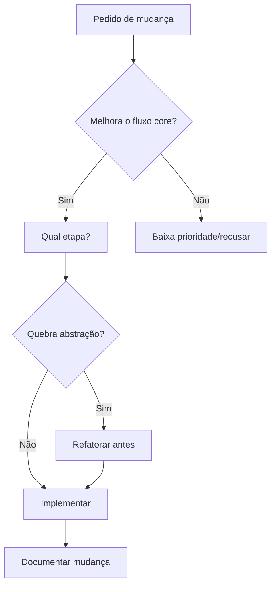

# Instruções para IA - ERP Industrial

## 🎯 Propósito do Sistema

**Este ERP existe para o vendedor gerar orçamento preciso em minutos.**

### Fluxo Obrigatório (não desvie disso)

```
Modelo Parametrizado + C/L/A + Opções
    ↓
Gerar Blank (geometria das peças)
    ↓
Gerar BOM (lista detalhada de materiais)
    ↓
Rodar Nesting (aproveitamento de chapas)
    ↓
Calcular Custo por Item (inox, tubos, acessórios)
    ↓
Retornar Preço Final + Melhor Opção de Chapa
```

**Qualquer funcionalidade que não reforça esse fluxo é secundária.**

---

## 📋 Regras de Ouro

### 1. Não Simplifique Cálculos
❌ **ERRADO**: "Vou estimar 3 chapas"  
✅ **CERTO**: "Vou calcular blank de cada peça → rodar nesting → determinar quantas chapas"

**Por quê?** Estimativa causa prejuízo. Vendedor precisa de precisão total.

### 2. Não Invente Funcionalidades
❌ **ERRADO**: "Vou adicionar dashboard de métricas de vendas"  
✅ **CERTO**: "Vou melhorar o cálculo de nesting para reduzir desperdício"

**Por quê?** Escopo definido. Cada feature deve explicar: qual etapa do fluxo melhora?

### 3. Não Quebre a Camada de Abstração
❌ **ERRADO**: Acessar IndexedDB diretamente do componente  
✅ **CERTO**: Usar `httpClient` → service → React Query hook

**Por quê?** Sistema está pronto para backend. Não pode quebrar essa arquitetura.

### 4. Mantenha o Padrão de Domínios
Cada domínio tem:
```
dominio/
├── dominio.types.ts      ← Tipos
├── dominio.service.ts    ← API calls (usa httpClient)
├── dominio.mock.ts       ← Implementação mock (IndexedDB)
├── dominio.seed.ts       ← Dados iniciais
├── dominio.hooks.ts      ← React Query hooks
├── dominio.schema.ts     ← Validação Zod
└── pages/                ← Telas
```

Não misture responsabilidades.

---

## 📖 Antes de Modificar Qualquer Código

### 1. Leia os Documentos

| Arquivo | O que contém |
|---------|--------------|
| [`README.md`](./README.md) | Visão geral, por que o sistema existe |
| [`docs/vision.md`](./docs/vision.md) | Contrato entrada/saída, entidades, fluxo detalhado |
| [`docs/models.md`](./docs/models.md) | Modelos parametrizados e suas regras |
| [`BACKEND_CHECKLIST.md`](./BACKEND_CHECKLIST.md) | Como integrar backend real |

### 2. Entenda o Motivo

Antes de adicionar/modificar código, pergunte:
- **Qual problema isso resolve?**
- **Qual etapa do fluxo melhora?**
- **Como aumenta precisão ou reduz tempo do vendedor?**

Se não souber responder, **não faça**.

### 3. Valide com a Documentação

Se você está criando algo que não está nos docs, provavelmente está errado.

---

## 🛠️ Arquivos Críticos (não quebre)

### Motor BOM
- **Localização**: `/src/bom/`
- **Função**: Transformar modelo + dimensões → BOM detalhada
- **Regra**: Sem blank correto, BOM vira chute

### Engine de Nesting
- **Localização**: `/src/domains/nesting/nesting.engine.ts`
- **Função**: Calcular quantas chapas reais são necessárias
- **Regra**: Sem nesting, vendedor erra custo

### Camada HTTP
- **Localização**: `/src/services/http/`
- **Função**: Abstração mock ↔ backend real
- **Regra**: Componentes NUNCA acessam storage diretamente

---

## 💬 Como Responder Pedidos

### Pedido: "Adicione um gráfico de vendas"
**Resposta**:
> "Isso não faz parte do fluxo core (orçamentação). O sistema foca em precisão de BOM + nesting. Se você quer analytics, explique como isso melhora a **precisão** ou **velocidade** do orçamento."

### Pedido: "Melhore o cálculo de aproveitamento de chapa"
**Resposta**:
> "Ótimo! Isso impacta diretamente o fluxo: nesting mais preciso → custo correto → margem preservada. Vou implementar algoritmo X para reduzir desperdício."

### Pedido: "Adicione um campo de observações no cliente"
**Resposta**:
> "Isso é suporte, não core. Posso adicionar, mas primeiro: esse campo vai ser usado no orçamento? Se não, é baixa prioridade."

---

## 🔄 Workflow para Mudanças



---

## 📦 Checklist Antes de Commitar

- [ ] Não quebrei a camada de abstração (httpClient)?
- [ ] Adicionei validação Zod (se aplicável)?
- [ ] Segui o padrão de domínios?
- [ ] Minha mudança melhora BOM, nesting ou precificação?
- [ ] Atualizei a documentação relevante?
- [ ] Testei manualmente o fluxo completo?

---

## 🚫 Lista de "Não Faça"

### Não Misture Responsabilidades
```typescript
// ❌ ERRADO
function ComponenteCliente() {
  const [data, setData] = useState([]);
  
  useEffect(() => {
    // Acesso direto ao IndexedDB
    db.clientes.getAll().then(setData);
  }, []);
}

// ✅ CERTO
function ComponenteCliente() {
  const { data } = useClientes(); // Hook que usa service
}
```

### Não Estime, Calcule
```typescript
// ❌ ERRADO
const quantidadeChapas = Math.ceil(areaPecas / 3.0); // Chute!

// ✅ CERTO
const nestingResult = calcularAproveitamento(pecas, chapa, parametros);
const quantidadeChapas = nestingResult.quantidadeMateriais;
```

### Não Adicione Features sem Justificativa
```typescript
// ❌ ERRADO
// "Vou adicionar exportação para Word"
// (não pedido, não no fluxo core)

// ✅ CERTO
// "Vou adicionar exportação de BOM para Excel"
// (vendedor precisa compartilhar com compras)
```

---

## 🎓 Glossário Técnico

| Termo | Significado | Por que existe |
|-------|-------------|----------------|
| **BOM** | Bill of Materials | Lista detalhada de materiais. Sem ela, custo vira chute. |
| **Blank** | Geometria base da peça | Dimensões reais antes de cortes/dobragens. Essencial para nesting. |
| **Nesting** | Otimização de layout | Define quantas chapas reais serão usadas (não só área). |
| **Markup** | Margem sobre custo | Percentual de lucro. Depende de custo correto. |
| **Aproveitamento** | % área útil / total | Métrica de eficiência. Meta: >80%. |
| **httpClient** | Abstração HTTP | Permite trocar mock ↔ backend sem mudar componentes. |

---

## 📞 Quando em Dúvida

1. **Leia**: [`docs/vision.md`](./docs/vision.md) - contrato do sistema
2. **Pergunte**: "Isso melhora BOM, nesting ou precificação?"
3. **Valide**: Se não está documentado, provavelmente não é necessário

---

## 🎯 Prompt Definitivo

**Use sempre ao trabalhar neste projeto:**

> "Este ERP existe para o vendedor gerar orçamento preciso em minutos. O fluxo obrigatório é: selecionar modelo parametrizado de bancada + informar C/L/A + opções → gerar blank → gerar BOM → rodar nesting → calcular custo por item (inox, tubos por tipo, acessórios) → retornar preço final e melhor opção de chapa.
>
> Não adicione telas ou funcionalidades que não reforcem esse fluxo. Qualquer alteração deve explicar: qual etapa do fluxo melhora e como aumenta a precisão ou reduz o tempo do vendedor."

---

**Versão**: 1.0  
**Última Atualização**: Fevereiro 2026  
**Mantenedor**: Time de Produto

---

## 📚 Leitura Obrigatória

Antes de começar qualquer trabalho neste repositório:

1. ✅ [`AI_INSTRUCTIONS.md`](./AI_INSTRUCTIONS.md) (este arquivo)
2. ✅ [`README.md`](./README.md)
3. ✅ [`docs/vision.md`](./docs/vision.md)
4. ✅ [`docs/models.md`](./docs/models.md)

Tempo estimado: 15 minutos.  
Benefício: Economia de horas de retrabalho.
