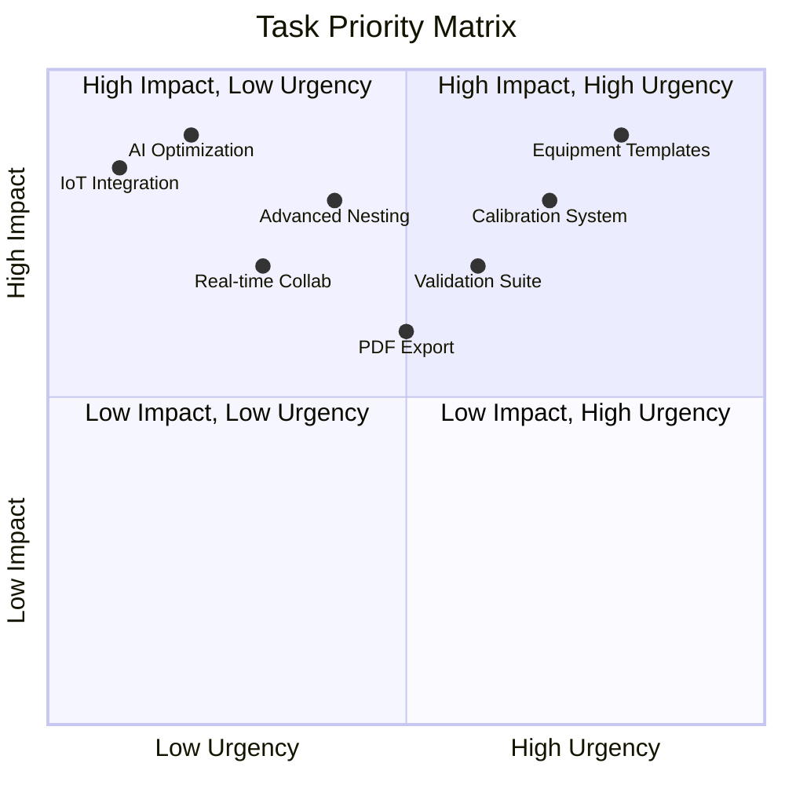

# INOX-VAL Backlog

> **Version:** 1.0.0  
> **Last Updated:** 2026-02-18  
> **Status:** Living Document

---

## Overview

This backlog contains all epics and tasks for INOX-VAL, organized by phase and priority. Each item has a unique ID for tracking.

---

## Backlog Statistics

| Phase | Epics | Tasks | Completed | In Progress | Pending |
|-------|-------|-------|-----------|-------------|---------|
| ESSENCIAL | 5 | 25 | 25 | 0 | 0 |
| PRODUTIVO | 6 | 32 | 8 | 4 | 20 |
| DIFERENCIAL | 4 | 20 | 0 | 0 | 20 |
| NASA | 4 | 16 | 0 | 0 | 16 |
| **Total** | **19** | **93** | **33** | **4** | **56** |

---

## Phase 1: ESSENCIAL

### EPIC-001: Engine Core

**Status:** COMPLETE  
**Priority:** P0  
**Business Value:** Foundation for all calculations

| Task ID | Task | Status | Assignee |
|---------|------|--------|----------|
| TASK-001 | Define core types in types.ts | COMPLETE | - |
| TASK-002 | Create MaterialKey parser/formatter | COMPLETE | - |
| TASK-003 | Define ProcessKey enum | COMPLETE | - |
| TASK-004 | Create BOM type definitions | COMPLETE | - |
| TASK-005 | Create QuoteSnapshot type | COMPLETE | - |
| TASK-006 | Define EngineResult wrapper type | COMPLETE | - |
| TASK-007 | Create DEFAULT_RULESET configuration | COMPLETE | - |

---

### EPIC-002: Geometry & Mass Engines

**Status:** COMPLETE  
**Priority:** P0  
**Business Value:** Accurate material calculations

| Task ID | Task | Status | Assignee |
|---------|------|--------|----------|
| TASK-008 | Implement computeAreaMm2 function | COMPLETE | - |
| TASK-009 | Implement computeBlank function | COMPLETE | - |
| TASK-010 | Implement computeCutLengthMm function | COMPLETE | - |
| TASK-011 | Implement computeMassKg for sheets | COMPLETE | - |
| TASK-012 | Implement computeTubeMassKg for tubes | COMPLETE | - |
| TASK-013 | Create getDensity lookup function | COMPLETE | - |
| TASK-014 | Write unit tests for geometry | COMPLETE | - |
| TASK-015 | Write unit tests for mass | COMPLETE | - |

---

### EPIC-003: Nesting Engine

**Status:** COMPLETE  
**Priority:** P0  
**Business Value:** Material optimization

| Task ID | Task | Status | Assignee |
|---------|------|--------|----------|
| TASK-016 | Implement Guillotine Best-Fit algorithm | COMPLETE | - |
| TASK-017 | Add kerf compensation | COMPLETE | - |
| TASK-018 | Add margin handling | COMPLETE | - |
| TASK-019 | Add grain direction constraints | COMPLETE | - |
| TASK-020 | Add rotation control | COMPLETE | - |
| TASK-021 | Create preparePartsForNesting utility | COMPLETE | - |
| TASK-022 | Write nesting unit tests | COMPLETE | - |

---

### EPIC-004: Cost & Pricing Engines

**Status:** COMPLETE  
**Priority:** P0  
**Business Value:** Accurate cost calculation

| Task ID | Task | Status | Assignee |
|---------|------|--------|----------|
| TASK-023 | Implement calculateMaterialCost | COMPLETE | - |
| TASK-024 | Implement calculateProcessCost | COMPLETE | - |
| TASK-025 | Implement markup pricing method | COMPLETE | - |
| TASK-026 | Implement target-margin pricing method | COMPLETE | - |
| TASK-027 | Implement minimum-profit pricing method | COMPLETE | - |
| TASK-028 | Implement max-discount pricing method | COMPLETE | - |
| TASK-029 | Write pricing unit tests | COMPLETE | - |

---

### EPIC-005: Quote & Audit System

**Status:** COMPLETE  
**Priority:** P0  
**Business Value:** Quote lifecycle management

| Task ID | Task | Status | Assignee |
|---------|------|--------|----------|
| TASK-030 | Implement createQuoteDraft | COMPLETE | - |
| TASK-031 | Implement finalizeQuote with hash | COMPLETE | - |
| TASK-032 | Implement addAuditEvent | COMPLETE | - |
| TASK-033 | Implement verifySnapshotIntegrity | COMPLETE | - |
| TASK-034 | Create QuoteRepository interface | COMPLETE | - |
| TASK-035 | Write quote unit tests | COMPLETE | - |
| TASK-036 | Write audit unit tests | COMPLETE | - |

---

## Phase 2: PRODUTIVO

### EPIC-006: Equipment Templates DSL

**Status:** IN PROGRESS  
**Priority:** P1  
**Business Value:** Rapid quote creation with templates

| Task ID | Task | Status | Assignee |
|---------|------|--------|----------|
| TASK-037 | Design template DSL schema | COMPLETE | - |
| TASK-038 | Create TemplateRegistry | IN PROGRESS | - |
| TASK-039 | Implement MPLC_4P template | COMPLETE | - |
| TASK-040 | Implement MPLC_6P template | COMPLETE | - |
| TASK-041 | Implement MPLCP_4P template | COMPLETE | - |
| TASK-042 | Implement MPLCP_6P template | COMPLETE | - |
| TASK-043 | Implement MPLEP_4P template | COMPLETE | - |
| TASK-044 | Implement MPLEP_6P template | COMPLETE | - |
| TASK-045 | Implement MPLE4_INV_LD_4P template | COMPLETE | - |
| TASK-046 | Implement MPLE4_INV_LE_4P template | COMPLETE | - |
| TASK-047 | Implement MPVE_4P template | COMPLETE | - |
| TASK-048 | Implement remaining 6 templates | PENDING | - |
| TASK-049 | Create template parameter UI | IN PROGRESS | - |
| TASK-050 | Create template preview component | PENDING | - |
| TASK-051 | Write template validation tests | PENDING | - |
| TASK-052 | Create template documentation | PENDING | - |

---

### EPIC-007: Calibration System

**Status:** NOT STARTED  
**Priority:** P1  
**Business Value:** Accurate machine-specific calculations

| Task ID | Task | Status | Assignee |
|---------|------|--------|----------|
| TASK-053 | Design calibration data model | PENDING | - |
| TASK-054 | Create CalibrationService | PENDING | - |
| TASK-055 | Implement kerf calibration per machine | PENDING | - |
| TASK-056 | Implement bend allowance calibration | PENDING | - |
| TASK-057 | Implement weld efficiency calibration | PENDING | - |
| TASK-058 | Create calibration UI | PENDING | - |
| TASK-059 | Integrate calibration with engine | PENDING | - |
| TASK-060 | Write calibration tests | PENDING | - |

---

### EPIC-008: Validation Suite

**Status:** IN PROGRESS  
**Priority:** P1  
**Business Value:** Quality assurance

| Task ID | Task | Status | Assignee |
|---------|------|--------|----------|
| TASK-061 | Create test fixtures for materials | IN PROGRESS | - |
| TASK-062 | Create test fixtures for processes | IN PROGRESS | - |
| TASK-063 | Write integration tests for quote workflow | PENDING | - |
| TASK-064 | Write E2E tests for quote creation | PENDING | - |
| TASK-065 | Set up CI/CD test automation | PENDING | - |
| TASK-066 | Achieve 90% code coverage | PENDING | - |
| TASK-067 | Create performance benchmarks | PENDING | - |
| TASK-068 | Document testing strategy | PENDING | - |

---

### EPIC-009: PDF Export

**Status:** PARTIAL  
**Priority:** P1  
**Business Value:** Professional documentation

| Task ID | Task | Status | Assignee |
|---------|------|--------|----------|
| TASK-069 | Design PDF template layout | COMPLETE | - |
| TASK-070 | Implement company header component | COMPLETE | - |
| TASK-071 | Implement customer info section | COMPLETE | - |
| TASK-072 | Implement itemized materials section | PENDING | - |
| TASK-073 | Implement itemized processes section | PENDING | - |
| TASK-074 | Implement nesting visualization in PDF | PENDING | - |
| TASK-075 | Implement terms and conditions | PENDING | - |
| TASK-076 | Implement approval signatures | PENDING | - |
| TASK-077 | Create PDF preview UI | PENDING | - |
| TASK-078 | Write PDF generation tests | PENDING | - |

---

### EPIC-010: Inventory Management

**Status:** PARTIAL  
**Priority:** P1  
**Business Value:** Stock control

| Task ID | Task | Status | Assignee |
|---------|------|--------|----------|
| TASK-079 | Create EstoqueService | COMPLETE | - |
| TASK-080 | Implement stock level tracking | COMPLETE | - |
| TASK-081 | Implement stock movements | COMPLETE | - |
| TASK-082 | Create stock alerts | PENDING | - |
| TASK-083 | Integrate with purchase planning | PENDING | - |
| TASK-084 | Create inventory dashboard | PENDING | - |
| TASK-085 | Write inventory tests | PENDING | - |

---

### EPIC-011: Production Order Management

**Status:** PARTIAL  
**Priority:** P1  
**Business Value:** Shop floor control

| Task ID | Task | Status | Assignee |
|---------|------|--------|----------|
| TASK-086 | Create ProductionOrderService | COMPLETE | - |
| TASK-087 | Implement OP generation from quote | COMPLETE | - |
| TASK-088 | Implement production routes | COMPLETE | - |
| TASK-089 | Create OP status tracking | IN PROGRESS | - |
| TASK-090 | Implement production dashboard | IN PROGRESS | - |
| TASK-091 | Create TV dashboard for shop floor | COMPLETE | - |
| TASK-092 | Implement production reports | PENDING | - |
| TASK-093 | Write production tests | PENDING | - |

---

## Phase 3: DIFERENCIAL

### EPIC-012: Advanced Nesting Optimization

**Status:** PLANNED  
**Priority:** P2  
**Business Value:** Material savings

| Task ID | Task | Status | Assignee |
|---------|------|--------|----------|
| TASK-094 | Research optimization algorithms | PENDING | - |
| TASK-095 | Implement multi-sheet optimization | PENDING | - |
| TASK-096 | Implement remnant management | PENDING | - |
| TASK-097 | Implement priority-based placement | PENDING | - |
| TASK-098 | Create optimization benchmark suite | PENDING | - |
| TASK-099 | Integrate with existing nesting | PENDING | - |

---

### EPIC-013: Real-time Collaboration

**Status:** PLANNED  
**Priority:** P2  
**Business Value:** Team productivity

| Task ID | Task | Status | Assignee |
|---------|------|--------|----------|
| TASK-100 | Design collaboration architecture | PENDING | - |
| TASK-101 | Implement WebSocket infrastructure | PENDING | - |
| TASK-102 | Create presence indicators | PENDING | - |
| TASK-103 | Implement conflict resolution | PENDING | - |
| TASK-104 | Add change attribution | PENDING | - |
| TASK-105 | Implement undo/redo support | PENDING | - |

---

### EPIC-014: Mobile App

**Status:** PLANNED  
**Priority:** P2  
**Business Value:** Field operations

| Task ID | Task | Status | Assignee |
|---------|------|--------|----------|
| TASK-106 | Choose mobile framework | PENDING | - |
| TASK-107 | Design mobile UI/UX | PENDING | - |
| TASK-108 | Implement quote viewing | PENDING | - |
| TASK-109 | Implement production tracking | PENDING | - |
| TASK-110 | Implement inventory updates | PENDING | - |
| TASK-111 | Implement photo capture | PENDING | - |

---

### EPIC-015: Analytics Dashboard

**Status:** PLANNED  
**Priority:** P2  
**Business Value:** Business intelligence

| Task ID | Task | Status | Assignee |
|---------|------|--------|----------|
| TASK-112 | Design analytics data model | PENDING | - |
| TASK-113 | Create aggregation pipelines | PENDING | - |
| TASK-114 | Implement quote conversion metrics | PENDING | - |
| TASK-115 | Implement margin analysis | PENDING | - |
| TASK-116 | Implement utilization trends | PENDING | - |
| TASK-117 | Create analytics dashboard UI | PENDING | - |
| TASK-118 | Implement report generation | PENDING | - |

---

## Phase 4: NASA

### EPIC-016: AI-Powered Optimization

**Status:** FUTURE  
**Priority:** P3  
**Business Value:** Intelligent automation

| Task ID | Task | Status | Assignee |
|---------|------|--------|----------|
| TASK-119 | Collect training data | PENDING | - |
| TASK-120 | Design ML models | PENDING | - |
| TASK-121 | Implement material selection AI | PENDING | - |
| TASK-122 | Implement process optimization AI | PENDING | - |
| TASK-123 | Implement price prediction AI | PENDING | - |
| TASK-124 | Create AI suggestion UI | PENDING | - |

---

### EPIC-017: IoT Integration

**Status:** FUTURE  
**Priority:** P3  
**Business Value:** Real-time tracking

| Task ID | Task | Status | Assignee |
|---------|------|--------|----------|
| TASK-125 | Design IoT architecture | PENDING | - |
| TASK-126 | Implement MQTT/WebSocket bridge | PENDING | - |
| TASK-127 | Create machine status monitoring | PENDING | - |
| TASK-128 | Implement production counting | PENDING | - |
| TASK-129 | Implement quality metrics | PENDING | - |
| TASK-130 | Create IoT dashboard | PENDING | - |

---

### EPIC-018: Advanced Forecasting

**Status:** FUTURE  
**Priority:** P3  
**Business Value:** Planning efficiency

| Task ID | Task | Status | Assignee |
|---------|------|--------|----------|
| TASK-131 | Design forecasting models | PENDING | - |
| TASK-132 | Implement demand prediction | PENDING | - |
| TASK-133 | Implement seasonal analysis | PENDING | - |
| TASK-134 | Implement price trend analysis | PENDING | - |
| TASK-135 | Create forecasting dashboard | PENDING | - |

---

### EPIC-019: Accounting Integration

**Status:** FUTURE  
**Priority:** P3  
**Business Value:** Financial automation

| Task ID | Task | Status | Assignee |
|---------|------|--------|----------|
| TASK-136 | Research accounting APIs | PENDING | - |
| TASK-137 | Design integration architecture | PENDING | - |
| TASK-138 | Implement invoice generation | PENDING | - |
| TASK-139 | Implement cost center mapping | PENDING | - |
| TASK-140 | Implement payment tracking | PENDING | - |
| TASK-141 | Create financial reports | PENDING | - |

---

## Priority Matrix

---

## Sprint Planning

### Current Sprint: PRODUTIVO Phase

| Epic | Focus Area | Tasks in Sprint |
|------|------------|-----------------|
| EPIC-006 | Equipment Templates | TASK-038, TASK-049, TASK-050 |
| EPIC-008 | Validation Suite | TASK-061, TASK-062, TASK-063 |
| EPIC-011 | Production Orders | TASK-089, TASK-090 |

### Next Sprint

| Epic | Focus Area | Tasks Planned |
|------|------------|---------------|
| EPIC-007 | Calibration System | TASK-053 to TASK-056 |
| EPIC-009 | PDF Export | TASK-072 to TASK-075 |
| EPIC-010 | Inventory | TASK-082, TASK-083 |

---

## Definition of Done

A task is considered DONE when:

- [ ] Code implemented and reviewed
- [ ] Unit tests written and passing
- [ ] Integration tests passing (if applicable)
- [ ] Documentation updated
- [ ] No linting errors
- [ ] Code coverage maintained or improved
- [ ] QA verified (if UI component)

---

## Risk Register

| Risk ID | Risk | Probability | Impact | Mitigation |
|---------|------|-------------|--------|------------|
| RISK-001 | Template DSL complexity | High | High | Iterative development, prototypes |
| RISK-002 | PDF rendering issues | Medium | Medium | Use established library |
| RISK-003 | Real-time sync conflicts | Medium | High | Operational transforms |
| RISK-004 | AI model accuracy | High | High | Extensive testing, fallbacks |
| RISK-005 | IoT hardware compatibility | High | Medium | Standard protocols |

---

## Change Log

| Date | Change | Author |
|------|--------|--------|
| 2026-02-18 | Initial backlog creation | System |
| 2026-02-18 | Added ESSENCIAL phase tasks | System |
| 2026-02-18 | Added PRODUTIVO phase tasks | System |
| 2026-02-18 | Added DIFERENCIAL phase tasks | System |
| 2026-02-18 | Added NASA phase tasks | System |

---

## References

- [MASTER_BLUEPRINT.md](./MASTER_BLUEPRINT.md) - System architecture
- [ROADMAP.md](./ROADMAP.md) - Feature roadmap
- [DEPENDENCY_GRAPH.md](./DEPENDENCY_GRAPH.md) - Module dependencies