# INOX-VAL Dependency Graph

> **Version:** 1.0.0  
> **Last Updated:** 2026-02-18  
> **Status:** Living Document

---

## Overview

This document visualizes the dependencies between modules in the INOX-VAL system. Understanding these dependencies is critical for:
- Planning implementation order
- Impact analysis for changes
- Identifying coupling risks
- Refactoring decisions

---

## High-Level Architecture Dependencies

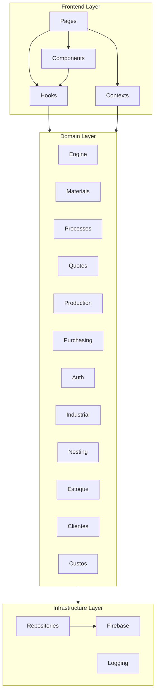

---

## Engine Module Dependencies

The engine is the core calculation module with zero external dependencies.

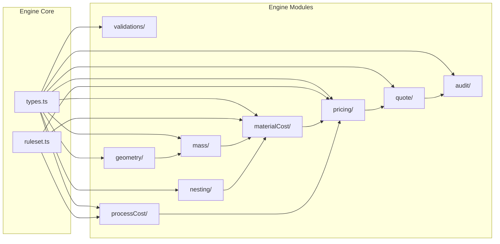

### Engine Dependency Table

| Module | Depends On | Used By |
|--------|------------|---------|
| `types.ts` | None | All engine modules |
| `ruleset.ts` | `types.ts` | materialCost, processCost, pricing |
| `validations/` | `types.ts` | quote, external services |
| `geometry/` | `types.ts` | mass, nesting |
| `mass/` | `types.ts`, `geometry/` | materialCost |
| `nesting/` | `types.ts`, `geometry/` | materialCost |
| `materialCost/` | `types.ts`, `ruleset.ts`, `mass/`, `nesting/` | pricing, quote |
| `processCost/` | `types.ts`, `ruleset.ts` | pricing, quote |
| `pricing/` | `types.ts`, `ruleset.ts`, `materialCost/`, `processCost/` | quote |
| `quote/` | `types.ts`, `validations/`, `materialCost/`, `processCost/`, `pricing/` | external services |
| `audit/` | `types.ts` | quote |

---

## Domain Layer Dependencies

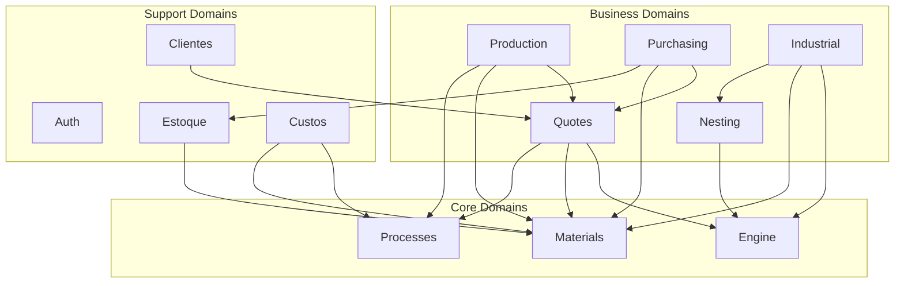

### Domain Dependency Matrix

| Domain | Engine | Materials | Processes | Quotes | Auth | Estoque |
|--------|--------|-----------|-----------|--------|------|---------|
| Materials | - | - | - | - | - | - |
| Processes | - | - | - | - | - | - |
| Quotes | **X** | **X** | **X** | - | - | - |
| Production | - | **X** | **X** | **X** | - | - |
| Purchasing | - | **X** | - | **X** | - | **X** |
| Industrial | **X** | **X** | - | - | - | - |
| Nesting | **X** | - | - | - | - | - |
| Estoque | - | **X** | - | - | - | - |
| Custos | - | **X** | **X** | - | - | - |
| Clientes | - | - | - | **X** | - | - |
| Auth | - | - | - | - | - | - |

---

## Infrastructure Dependencies

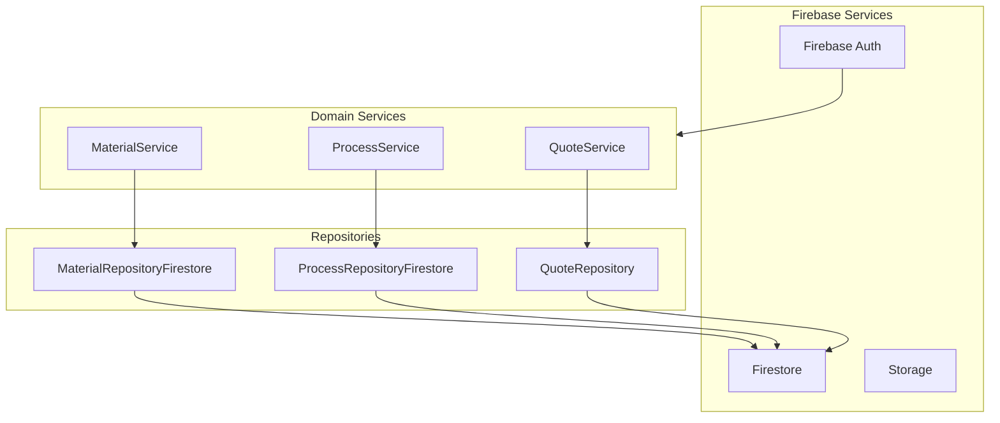

---

## UI Component Dependencies

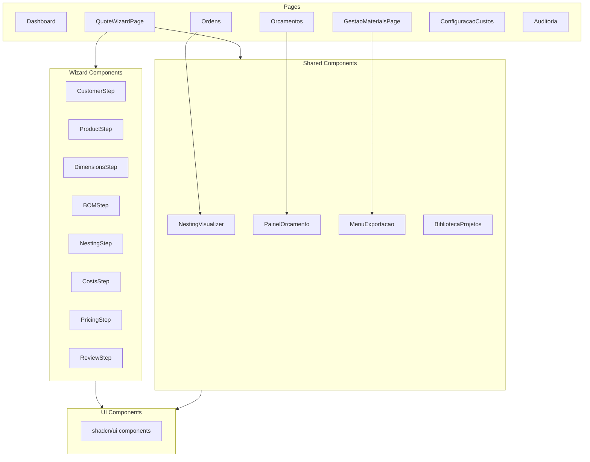

---

## Feature Dependencies by Phase

### ESSENCIAL Phase Dependencies

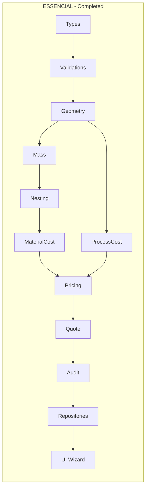

### PRODUTIVO Phase Dependencies

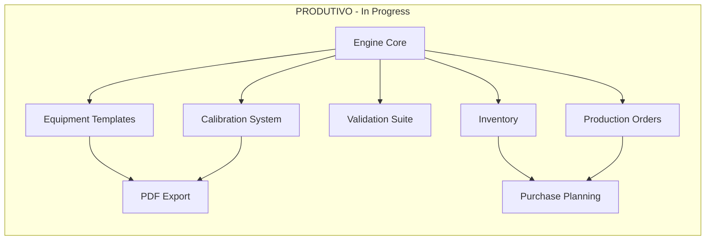

### DIFERENCIAL Phase Dependencies

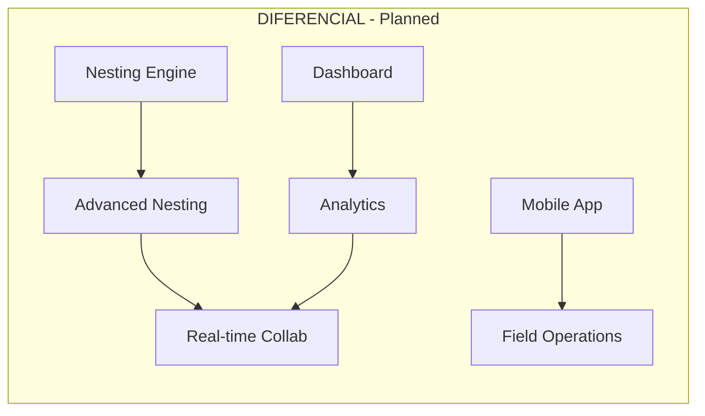

### NASA Phase Dependencies

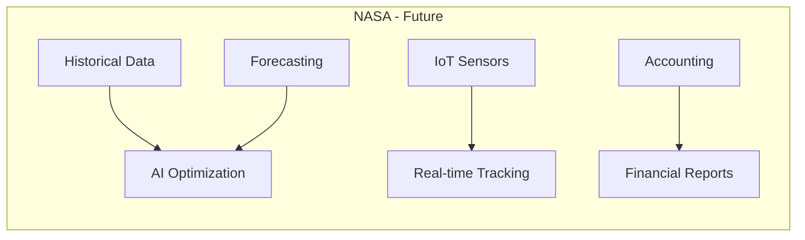

---

## Circular Dependency Detection

No circular dependencies detected in the current architecture. The layered architecture prevents cycles:

1. **Frontend** depends on **Domains**
2. **Domains** depend on **Infrastructure**
3. **Infrastructure** has no dependencies on upper layers

### Dependency Rules

| Layer | Can Depend On | Cannot Depend On |
|-------|---------------|------------------|
| Frontend | Domains, Infrastructure | - |
| Domains | Infrastructure | Frontend |
| Infrastructure | External libraries | Frontend, Domains |
| Engine | Nothing (pure) | Everything external |

---

## Coupling Analysis

### High Coupling Modules

| Module | Coupling Score | Risk |
|--------|---------------|------|
| `engine/quote/` | High | Medium - Many dependencies but stable |
| `domains/quotes/` | High | Medium - Core business logic |
| `app/pages/QuoteWizardPage` | High | Low - UI composition only |

### Low Coupling Modules

| Module | Coupling Score | Benefit |
|--------|---------------|---------|
| `engine/types.ts` | Very Low | Reusable, stable |
| `engine/geometry/` | Low | Pure functions, testable |
| `engine/mass/` | Low | Pure functions, testable |
| `domains/auth/` | Low | Isolated, replaceable |

---

## Dependency Injection Points

The system uses dependency injection at these boundaries:

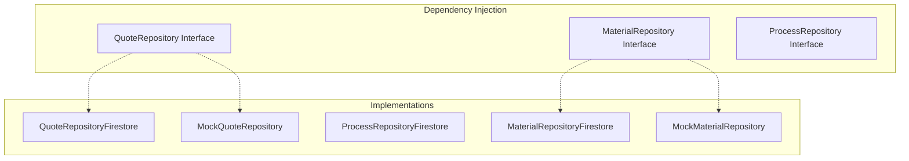

### Injectable Dependencies

| Interface | Implementations | Used By |
|-----------|-----------------|---------|
| `QuoteRepository` | Firestore, Mock | QuoteService |
| `MaterialRepository` | Firestore, Mock | MaterialService |
| `ProcessRepository` | Firestore, Mock | ProcessService |
| `AuthService` | Firebase, Mock | AuthContext |

---

## Import Graph

### Engine Import Structure

```
engine/
  index.ts              # Public API
  types.ts              # No imports (foundation)
  ruleset.ts            # imports types
  validations/index.ts  # imports types
  geometry/index.ts     # imports types
  mass/index.ts         # imports types, geometry
  nesting/index.ts      # imports types, geometry
  materialCost/index.ts # imports types, ruleset, mass, nesting
  processCost/index.ts  # imports types, ruleset
  pricing/index.ts      # imports types, ruleset, materialCost, processCost
  quote/index.ts        # imports types, validations, materialCost, processCost, pricing, audit
  audit/index.ts        # imports types
```

### Domain Import Structure

```
domains/
  materials/
    service.ts          # imports types, repository
    repository.ts       # imports infra/firebase
  processes/
    service.ts          # imports types, repository
    repository.ts       # imports infra/firebase
  quotes/
    types.ts            # imports engine/types
    index.ts            # imports types, engine/quote
  production/
    service.ts          # imports quotes, materials, processes
    types.ts            # imports engine/types
  purchasing/
    service.ts          # imports quotes, materials, estoque
    types.ts            # imports engine/types
```

---

## Refactoring Recommendations

### Recommended Decoupling

1. **Extract QuoteService Interface**
   - Create interface for QuoteService
   - Enable mock implementations for testing
   - Reduce coupling between UI and service

2. **Abstract Nesting Algorithm**
   - Create NestingStrategy interface
   - Allow algorithm swapping
   - Enable A/B testing of algorithms

3. **Event-Driven Communication**
   - Use event bus for cross-domain communication
   - Reduce direct dependencies
   - Enable loose coupling for future features

### Dependency Violations to Fix

| Violation | Location | Fix |
|-----------|----------|-----|
| None detected | - | - |

---

## Testing Dependencies

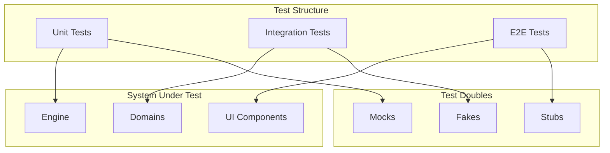

---

## References

- [MASTER_BLUEPRINT.md](./MASTER_BLUEPRINT.md) - System architecture
- [ROADMAP.md](./ROADMAP.md) - Feature roadmap
- [BACKLOG.md](./BACKLOG.md) - Task backlog