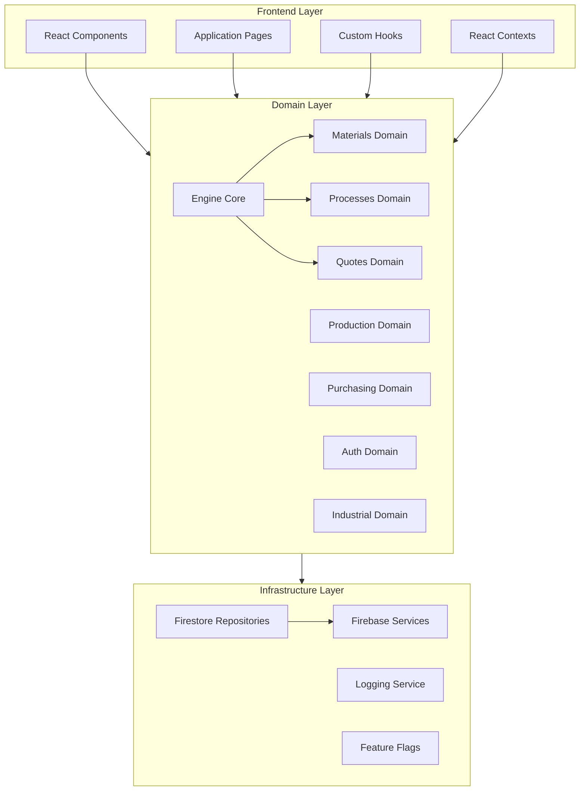
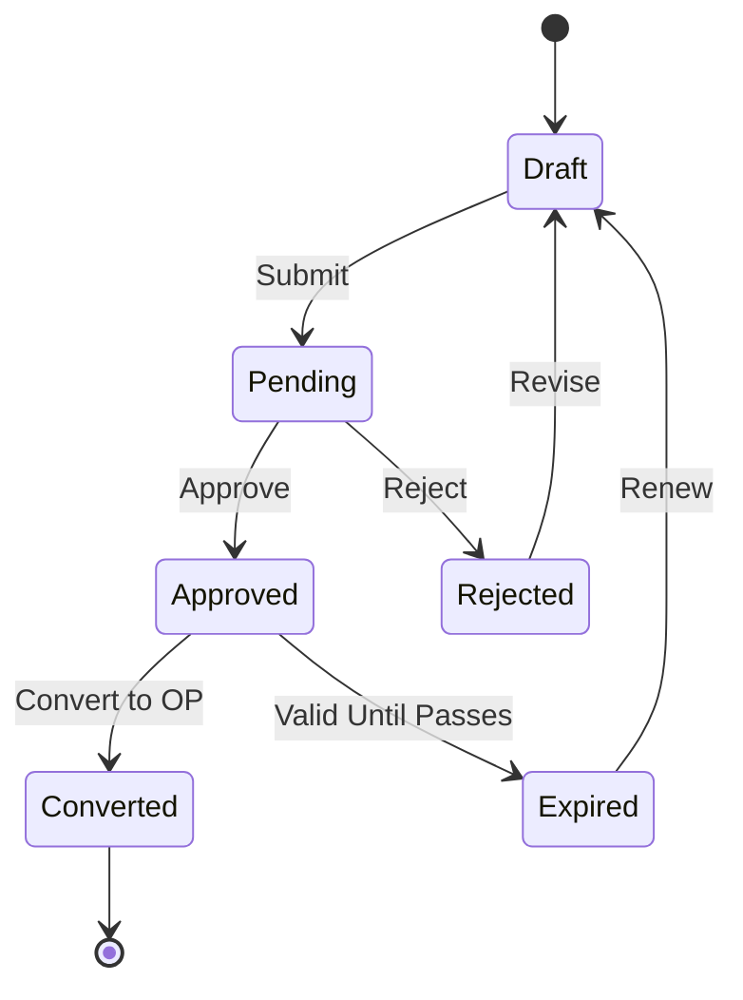
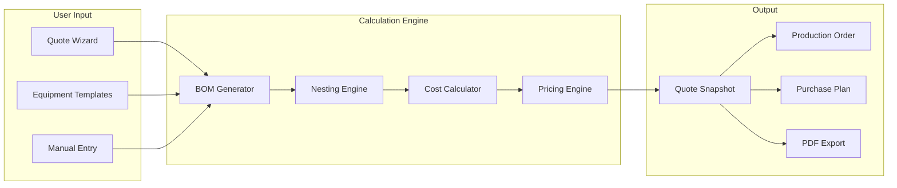
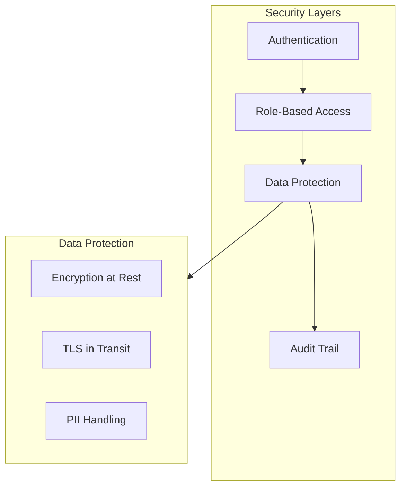

# INOX-VAL Master Blueprint

> **Version:** 1.0.0  
> **Last Updated:** 2026-02-18  
> **Status:** Living Document

---

## Executive Summary

INOX-VAL is a vertical ERP system for industrial stainless steel kitchen equipment manufacturing. The system focuses on:

1. **Perfect Quoting** - No guessing, full audit trail
2. **Precise Material Survey** - Sheets, tubes, accessories with real nesting
3. **Industrial Process Costs** - Cut, bend, weld, finish, assembly
4. **2D Nesting with Real Losses** - Kerf, margins, brushed direction, rotation
5. **Production Order Generation** - Consolidated purchase lists
6. **Immutable Snapshots** - Full reproducibility per quote

---

## System Architecture Overview



---

## Module Map

### 1. Engine Domain (`src/domains/engine/`)

The pure calculation engine with zero external dependencies.

| Module | Purpose | Status |
|--------|---------|--------|
| [`types.ts`](../src/domains/engine/types.ts) | Core type definitions | ESSENCIAL |
| [`ruleset.ts`](../src/domains/engine/ruleset.ts) | Business configuration | ESSENCIAL |
| [`validations/`](../src/domains/engine/validations/index.ts) | Input validators | ESSENCIAL |
| [`geometry/`](../src/domains/engine/geometry/index.ts) | Geometric calculations | ESSENCIAL |
| [`mass/`](../src/domains/engine/mass/index.ts) | Mass calculations | ESSENCIAL |
| [`nesting/`](../src/domains/engine/nesting/index.ts) | Guillotine nesting algorithm | ESSENCIAL |
| [`materialCost/`](../src/domains/engine/materialCost/index.ts) | Material cost calculation | ESSENCIAL |
| [`processCost/`](../src/domains/engine/processCost/index.ts) | Process cost calculation | ESSENCIAL |
| [`pricing/`](../src/domains/engine/pricing/index.ts) | 4 pricing methods | ESSENCIAL |
| [`quote/`](../src/domains/engine/quote/index.ts) | Quote lifecycle | ESSENCIAL |
| [`audit/`](../src/domains/engine/audit/index.ts) | Audit trail and integrity | ESSENCIAL |
| [`adapters/`](../src/domains/engine/adapters/) | Domain adapters | PRODUTIVO |

#### Engine Core Types

```typescript
// MaterialKey - Unique material identifier
// Format: "CHAPA#SS304#1.2#POLIDO#3000x1250#FORN_X"
type MaterialKind = 'sheet' | 'tube' | 'accessory' | 'other'

// ProcessKey - Process identifiers
type ProcessKey = 
  | 'CORTE_LASER' | 'CORTE_GUILHOTINA' | 'CORTE_PLASMA'
  | 'DOBRA' | 'SOLDA_TIG' | 'SOLDA_MIG' | 'SOLDA_LASER'
  | 'POLIMENTO' | 'ESCOVADO' | 'PASSIVACAO'
  | 'MONTAGEM' | 'EMBALAGEM' | 'FRETE'
  | 'CORTE_TUBO' | 'DOBRA_TUBO'

// BOM - Bill of Materials
interface BOM {
  sheets: SheetPart[]
  tubes: TubePart[]
  accessories: AccessoryPart[]
  processes: ProcessKey[]
}

// QuoteSnapshot - Immutable quote state
interface QuoteSnapshot {
  id: string
  version: string
  bom: BOM
  nesting: NestingResult
  costs: CostBreakdown
  pricing: PricingResult
  hash: string  // SHA256
  auditEvents: AuditEvent[]
}
```

---

### 2. Materials Domain (`src/domains/materials/`, `src/domains/materiais/`)

Material registry and pricing management.

| Module | Purpose | Status |
|--------|---------|--------|
| [`repository.ts`](../src/domains/materiais/repository.ts) | Firestore material repository | ESSENCIAL |
| [`service.ts`](../src/domains/materiais/service.ts) | Material business logic | ESSENCIAL |
| [`types.ts`](../src/domains/materiais/types.ts) | Material type definitions | ESSENCIAL |

#### Material Categories

- **Sheets** - Stainless steel sheets with dimensions, finish, thickness
- **Tubes** - Round, square, rectangular profiles
- **Angles** - L-shaped structural profiles
- **Accessories** - Fasteners, hydraulic, electrical components

---

### 3. Processes Domain (`src/domains/processes/`)

Industrial process configuration and costing.

| Module | Purpose | Status |
|--------|---------|--------|
| [`service.ts`](../src/domains/processes/service.ts) | Process management | ESSENCIAL |
| [`types.ts`](../src/domains/processes/types.ts) | Process definitions | ESSENCIAL |

#### Process Categories

| Category | Processes | Cost Model |
|----------|-----------|------------|
| Cutting | LASER, GUILHOTINA, PLASMA | per meter + setup |
| Forming | DOBRA, DOBRA_TUBO | per bend + setup |
| Joining | SOLDA_TIG, SOLDA_MIG, SOLDA_LASER | per meter + setup |
| Finishing | POLIMENTO, ESCOVADO, PASSIVACAO | per m² |
| Assembly | MONTAGEM, EMBALAGEM | per hour |
| Logistics | FRETE | per km or fixed |

---

### 4. Quotes Domain (`src/domains/quotes/`)

Quote lifecycle management with snapshots.

| Module | Purpose | Status |
|--------|---------|--------|
| [`types.ts`](../src/domains/quotes/types.ts) | Quote types and repository interface | ESSENCIAL |
| [`index.ts`](../src/domains/quotes/index.ts) | Quote exports | ESSENCIAL |

#### Quote Workflow



---

### 5. Production Domain (`src/domains/production/`, `src/domains/producao/`)

Production order management and shop floor control.

| Module | Purpose | Status |
|--------|---------|--------|
| [`service.ts`](../src/domains/production/service.ts) | Production order service | ESSENCIAL |
| [`types.ts`](../src/domains/production/types.ts) | Production types | ESSENCIAL |
| [`producao/pages/`](../src/domains/producao/pages/) | Production UI pages | PRODUTIVO |

---

### 6. Purchasing Domain (`src/domains/purchasing/`)

Consolidated purchase planning from quotes.

| Module | Purpose | Status |
|--------|---------|--------|
| [`service.ts`](../src/domains/purchasing/service.ts) | Purchase plan generation | ESSENCIAL |
| [`types.ts`](../src/domains/purchasing/types.ts) | Purchase types | ESSENCIAL |

---

### 7. Auth Domain (`src/domains/auth/`)

Authentication and role-based access control.

| Module | Purpose | Status |
|--------|---------|--------|
| [`service.ts`](../src/domains/auth/service.ts) | Auth service | ESSENCIAL |
| [`types.ts`](../src/domains/auth/types.ts) | User and role types | ESSENCIAL |

#### RBAC Roles

| Role | Permissions |
|------|-------------|
| `admin` | Full system access |
| `gerente` | Management access, no user deletion |
| `engenheiro` | Technical operations, quotes, production |
| `vendedor` | Quotes and customers only |
| `producao` | Production floor operations |
| `compras` | Purchasing and materials |

---

### 8. Industrial Domain (`src/domains/industrial/`)

Industrial-specific entities and calculations.

| Module | Purpose | Status |
|--------|---------|--------|
| [`entities.ts`](../src/domains/industrial/entities.ts) | Industrial entity definitions | ESSENCIAL |
| [`service.ts`](../src/domains/industrial/service.ts) | Registry service | ESSENCIAL |
| [`repository.ts`](../src/domains/industrial/repository.ts) | Data persistence | ESSENCIAL |
| [`bom.ts`](../src/domains/industrial/bom.ts) | BOM generation | ESSENCIAL |
| [`nesting.ts`](../src/domains/industrial/nesting.ts) | Industrial nesting | ESSENCIAL |

---

### 9. Nesting Domain (`src/domains/nesting/`)

Advanced 2D nesting optimization.

| Module | Purpose | Status |
|--------|---------|--------|
| [`nesting.engine.ts`](../src/domains/nesting/nesting.engine.ts) | Nesting algorithm | ESSENCIAL |
| [`nesting.service.ts`](../src/domains/nesting/nesting.service.ts) | Nesting service | ESSENCIAL |
| [`pack2d.ts`](../src/domains/nesting/pack2d.ts) | 2D packing utilities | ESSENCIAL |
| [`components/`](../src/domains/nesting/components/) | Nesting visualizer | PRODUTIVO |

---

### 10. Infrastructure Layer (`src/infra/`)

External service integrations.

| Module | Purpose | Status |
|--------|---------|--------|
| [`firebase/`](../src/infra/firebase/) | Firebase initialization | ESSENCIAL |
| [`repositories/`](../src/infra/repositories/) | Firestore implementations | ESSENCIAL |
| [`logging/`](../src/infra/logging/) | Logging service | PRODUTIVO |
| [`featureFlags/`](../src/infra/featureFlags/) | Feature flag system | DIFERENCIAL |

---

### 11. Application Layer (`src/app/`)

React application structure.

| Module | Purpose | Status |
|--------|---------|--------|
| [`components/`](../src/app/components/) | Reusable UI components | ESSENCIAL |
| [`pages/`](../src/app/pages/) | Application pages | ESSENCIAL |
| [`hooks/`](../src/app/hooks/) | Custom React hooks | ESSENCIAL |
| [`contexts/`](../src/app/contexts/) | React contexts | ESSENCIAL |
| [`lib/`](../src/app/lib/) | Application utilities | ESSENCIAL |

#### Key Pages

| Page | Route | Purpose |
|------|-------|---------|
| Dashboard | `/` | Main dashboard |
| QuoteWizard | `/orcamento/novo` | Quote creation wizard |
| Quotes | `/orcamentos` | Quote list |
| Orders | `/ordens` | Production orders |
| Materials | `/materiais` | Material management |
| Costs | `/custos` | Cost configuration |
| Audit | `/auditoria` | Audit trail |

---

## Data Flow Architecture



---

## Integration Points

### External Integrations

| Integration | Purpose | Status |
|------------|---------|--------|
| Firebase Auth | User authentication | ESSENCIAL |
| Firestore | Data persistence | ESSENCIAL |
| Vercel | Hosting and deployment | ESSENCIAL |
| PDF Export | Quote documentation | PRODUTIVO |
| Excel Import/Export | Bulk operations | PRODUTIVO |

### Future Integrations

| Integration | Purpose | Phase |
|------------|---------|-------|
| Email Service | Notifications | PRODUTIVO |
| SMS/WhatsApp | Customer alerts | DIFERENCIAL |
| Accounting API | Financial sync | DIFERENCIAL |
| IoT Sensors | Production tracking | NASA |
| AI/ML Services | Optimization | NASA |

---

## Security Architecture



### Security Principles

1. **Defense in Depth** - Multiple security layers
2. **Least Privilege** - Minimum required permissions
3. **Audit Everything** - Complete audit trail
4. **Data Integrity** - SHA256 hash verification
5. **Secure by Default** - Secure initial configuration

---

## Performance Considerations

### Caching Strategy

| Layer | Cache Type | TTL |
|-------|------------|-----|
| Material Registry | In-memory | 5 min |
| Process Config | In-memory | 5 min |
| User Session | Firebase | 1 hour |
| Quote Snapshots | Firestore | Persistent |

### Optimization Targets

- Quote calculation: < 2 seconds
- Nesting visualization: < 1 second render
- Page load: < 3 seconds
- API response: < 500ms

---

## Technology Stack

| Layer | Technology |
|-------|------------|
| Frontend | React 18, TypeScript, Tailwind CSS |
| State | React Context, Custom Hooks |
| UI Components | shadcn/ui, Radix primitives |
| Backend | Firebase, Firestore |
| Auth | Firebase Authentication |
| Hosting | Vercel |
| Testing | Vitest, React Testing Library |
| Build | Vite |

---

## File Structure Reference

```
src/
  domains/           # Business logic modules
    engine/          # Pure calculation engine
      types.ts       # Core types
      ruleset.ts     # Business rules
      validations/   # Input validation
      geometry/      # Geometric calculations
      mass/          # Mass calculations
      nesting/       # Nesting algorithm
      materialCost/  # Material costing
      processCost/   # Process costing
      pricing/       # Pricing methods
      quote/         # Quote lifecycle
      audit/         # Audit system
    materials/       # Material management
    processes/       # Process management
    quotes/          # Quote management
    production/      # Production orders
    purchasing/      # Purchase planning
    auth/            # Authentication
    industrial/      # Industrial specifics
    nesting/         # Advanced nesting
    clientes/        # Customer management
    estoque/         # Inventory
    custos/          # Cost configuration
    usuarios/        # User management
    
  infra/             # Infrastructure
    firebase/        # Firebase setup
    repositories/    # Data repositories
    logging/         # Logging service
    featureFlags/    # Feature flags
    
  app/               # Application layer
    components/      # UI components
    pages/           # Application pages
    hooks/           # Custom hooks
    contexts/        # React contexts
    lib/             # Utilities
```

---

## Next Steps

1. Review [ROADMAP.md](./ROADMAP.md) for implementation phases
2. Check [BACKLOG.md](./BACKLOG.md) for detailed tasks
3. See [DEPENDENCY_GRAPH.md](./DEPENDENCY_GRAPH.md) for module dependencies