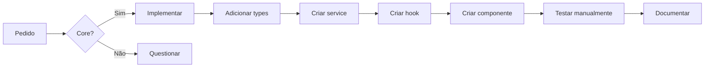

# Quick Start - ERP Industrial

## Para Desenvolvedores

### 1. Instalação (2 minutos)

```bash
# Clone o repositório
git clone [url-do-repo]
cd erp-industrial

# Instale dependências
pnpm install

# Inicie o servidor de desenvolvimento
pnpm dev
```

Acesse: `http://localhost:5173`

### 2. Login de Teste

| Perfil | Email | Senha | Permissões |
|--------|-------|-------|------------|
| Admin | `admin@inox.com` | `123456` | Todas |
| Vendedor | `vendedor@inox.com` | `123456` | Orçamentos, clientes |
| Operador | `operador@inox.com` | `123456` | Produção |

### 3. Testando o Fluxo Principal

#### A) Calculadora Rápida

1. Acesse: **Menu → Calculadora Rápida**
2. Selecione modelo: **"Bancada com Encosto Liso"**
3. Digite dimensões:
   - Comprimento: `1200 mm`
   - Largura: `600 mm`
   - Altura: `850 mm`
4. Opções:
   - Estrutura: `Contraventada`
   - Prateleira: ✅ `Sim`
5. Clique: **"Calcular Orçamento"**

**Resultado esperado** (em < 2 segundos):
- ✅ BOM detalhada (chapas, tubos, acessórios)
- ✅ Nesting (2-3 chapas necessárias)
- ✅ Precificação (R$ 4.000 - R$ 5.000)

#### B) Gestão de Clientes

1. Acesse: **Menu → Clientes**
2. Veja lista de clientes mockados
3. Clique em qualquer cliente → ver detalhes
4. Clique **"Novo Cliente"** → formulário com validações
5. Teste filtros (nome, cidade, tipo)
6. Exporte para Excel

#### C) Chat Interno

1. Acesse: **Menu → Chat** (ou ícone no header)
2. Veja lista de conversas
3. Clique em uma conversa
4. Digite mensagem → enter
5. Observe status online/offline simulado

---

## Para IAs Trabalhando no Projeto

### 1. Leia Primeiro (obrigatório)

```
┌─────────────────────────────────────────┐
│ Leitura Obrigatória (15 min)            │
├─────────────────────────────────────────┤
│                                         │
│ 1. AI_INSTRUCTIONS.md  ← Comece aqui!  │
│ 2. README.md                            │
│ 3. docs/vision.md                       │
│ 4. docs/models.md                       │
│                                         │
└─────────────────────────────────────────┘
```

### 2. Antes de Qualquer Mudança

Pergunte:
1. ❓ **Qual problema isso resolve?**
2. ❓ **Melhora BOM, nesting ou precificação?**
3. ❓ **Reduz tempo do vendedor?**

Se não souber responder → **não faça**.

### 3. Estrutura do Código

```
src/
├── app/                  # UI principal
│   ├── pages/           # Telas
│   └── components/      # Componentes reutilizáveis
│
├── domains/             # Domínios de negócio ⭐
│   ├── clientes/       # CRUD clientes
│   ├── produtos/       # CRUD produtos
│   ├── nesting/        # Calculadora + Nesting ⭐⭐⭐
│   └── ...
│
├── bom/                 # Motor BOM ⭐⭐⭐
│   └── models/         # Modelos parametrizados
│
├── services/           # Camada de abstração
│   └── http/          # httpClient (mock ↔ backend)
│
└── shared/            # Código compartilhado
```

**Legenda**:
- ⭐⭐⭐ = **Core do sistema** (não quebre!)
- ⭐ = Importante
- Sem estrela = Suporte

### 4. Padrão de Domínio

Ao trabalhar em qualquer domínio:

```typescript
// 1. Tipos (dominio.types.ts)
export interface Cliente {
  id: string;
  nome: string;
  // ...
}

// 2. Service (dominio.service.ts)
import { httpClient } from '@/services/http/client';

export const clientesService = {
  async list() {
    return httpClient.get<Cliente[]>('/api/clientes');
  }
};

// 3. Hook (dominio.hooks.ts)
import { useQuery } from '@tanstack/react-query';

export function useClientes() {
  return useQuery({
    queryKey: ['clientes'],
    queryFn: () => clientesService.list()
  });
}

// 4. Componente (pages/ClientesList.tsx)
export function ClientesList() {
  const { data } = useClientes(); // ← Hook
  // render...
}
```

**Nunca acesse storage/IndexedDB diretamente!**

### 5. Adicionando Nova Feature



---

## Para Product Managers

### Métricas de Sucesso

#### Tempo de Orçamentação
- **Antes**: 2-3 horas por bancada
- **Depois**: 2-5 minutos
- **Meta**: < 3 minutos

#### Precisão de Custo
- **Antes**: ~70% (muitas estimativas)
- **Depois**: 95%+
- **Meta**: > 95%

#### Taxa de Fechamento
- **Antes**: baseline
- **Depois**: +30%
- **Meta**: +40%

### Roadmap Simplificado

```
Fase 1: Core ✅ (Concluído)
└─ Modelos parametrizados
└─ Motor BOM
└─ Nesting básico
└─ Precificação

Fase 2: Otimizações 🚧 (Próxima)
└─ Nesting inteligente (algoritmo genético)
└─ Comparação de fornecedores
└─ Histórico de preços

Fase 3: Backend 📅 (Q2 2026)
└─ API REST real
└─ Banco PostgreSQL
└─ Autenticação JWT

Fase 4: Produção 📅 (Q3 2026)
└─ Geração CAD
└─ Integração CNC
└─ QR codes
```

---

## Para Backend Developers

### Preparação do Sistema

O frontend está **100% pronto** para backend. Basta:

1. **Implementar endpoints REST** (veja [`API_ENDPOINTS.md`](../API_ENDPOINTS.md))
2. **Substituir mock por cliente real**:

```typescript
// Em src/services/http/client.ts

// ANTES (mock)
export function getHttpClient(): HttpClient {
  return mockClient;
}

// DEPOIS (backend real)
export function getHttpClient(): HttpClient {
  return apiClient; // Axios configurado
}
```

3. **Componentes não mudam!** 🎉

### Endpoints Críticos

Prioridade alta:

1. `GET /api/clientes` - Lista clientes
2. `POST /api/orcamentos` - Criar orçamento
3. `POST /api/calcular-bom` - Motor BOM ⭐⭐⭐
4. `POST /api/nesting` - Engine nesting ⭐⭐⭐

Veja: [`BACKEND_CHECKLIST.md`](../BACKEND_CHECKLIST.md) para detalhes completos.

---

## Troubleshooting

### Erro: "Failed to resolve import"

**Causa**: Caminho de import incorreto  
**Solução**: Use aliases configurados:
- `@/` → `/src/`
- `@/services/` → `/src/services/`
- `@/domains/` → `/src/domains/`

### Calculadora não retorna resultado

**Causa**: Modelo não implementado ou dimensões inválidas  
**Solução**: 
1. Verifique console do navegador
2. Valide dimensões (min/max em `docs/models.md`)
3. Teste com modelo MPLC (mais simples)

### Performance lenta em lista grande

**Causa**: Muitos dados mockados  
**Solução**: Adicione paginação no service:

```typescript
const { data } = useClientes({
  page: 1,
  limit: 50  // ← Limitar resultados
});
```

---

## Comandos Úteis

```bash
# Desenvolvimento
pnpm dev          # Inicia dev server

# Build
pnpm build        # Build de produção
pnpm preview      # Preview do build

# Linting
pnpm lint         # Verifica código

# Type checking
pnpm type-check   # Verifica tipos TypeScript
```

---

## Recursos Adicionais

### Documentação Completa
- [`README.md`](../README.md) - Visão geral
- [`AI_INSTRUCTIONS.md`](../AI_INSTRUCTIONS.md) - Regras para IA
- [`docs/vision.md`](./vision.md) - Visão e contrato
- [`docs/models.md`](./models.md) - Modelos parametrizados
- [`BACKEND_CHECKLIST.md`](../BACKEND_CHECKLIST.md) - Integração backend
- [`API_ENDPOINTS.md`](../API_ENDPOINTS.md) - Endpoints da API
- [`DATABASE_SCHEMAS.md`](../DATABASE_SCHEMAS.md) - Schemas do banco

### Stack Técnico
- [React 18 Docs](https://react.dev)
- [TypeScript Handbook](https://www.typescriptlang.org/docs/)
- [TanStack Query](https://tanstack.com/query/latest)
- [React Router v7](https://reactrouter.com)
- [Shadcn/ui](https://ui.shadcn.com)
- [Tailwind CSS](https://tailwindcss.com)

---

## Suporte

### Para Desenvolvedores
1. Leia a documentação primeiro
2. Verifique console do navegador
3. Teste em modo incógnito (evitar cache)

### Para IAs
1. **SEMPRE** leia [`AI_INSTRUCTIONS.md`](../AI_INSTRUCTIONS.md) antes de modificar código
2. Use o prompt definitivo fornecido
3. Valide mudanças contra o fluxo core

---

**Última Atualização**: Fevereiro 2026
