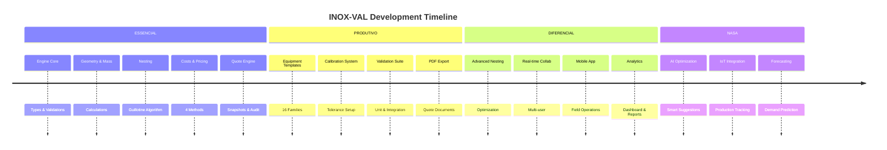
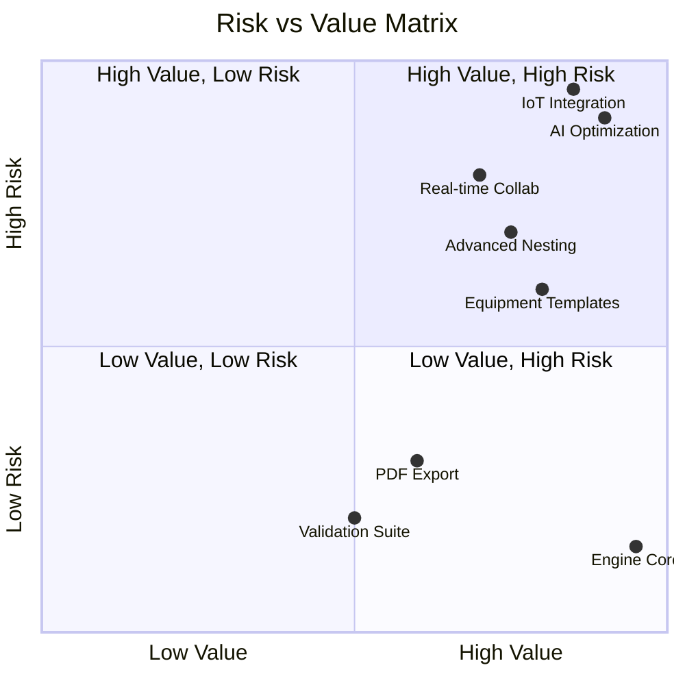

# INOX-VAL Roadmap

> **Version:** 1.0.0  
> **Last Updated:** 2026-02-18  
> **Status:** Living Document

---

## Overview

This roadmap defines the implementation phases for INOX-VAL, organized by priority and business value. Each feature includes clear objectives, data requirements, affected modules, risk assessment, and acceptance criteria.

---

## Phase Progress



---

## Phase 1: ESSENCIAL

**Status:** IMPLEMENTED  
**Priority:** P0 - Critical  
**Business Value:** Core functionality for MVP

### Features

#### FEAT-001: Engine Core Types

| Attribute | Value |
|-----------|-------|
| **Objective** | Define all core types for the calculation engine |
| **Data Required** | Material, Process, BOM, Quote structures |
| **Modules Affected** | `engine/types.ts`, `engine/ruleset.ts` |
| **Risk** | Low - Type definitions only |
| **Acceptance** | All types documented, exported, and tested |

**Implementation Status:** COMPLETE

---

#### FEAT-002: Geometry Engine

| Attribute | Value |
|-----------|-------|
| **Objective** | Calculate geometric properties for materials |
| **Data Required** | Part dimensions, blank sizes |
| **Modules Affected** | `engine/geometry/` |
| **Risk** | Low - Pure mathematical functions |
| **Acceptance** | Area, perimeter, blank calculations verified with test cases |

**Functions:**
- `computeAreaMm2(part)` - Calculate part area in mm²
- `computeBlank(part)` - Calculate blank dimensions
- `computeCutLengthMm(part)` - Calculate total cut length

**Implementation Status:** COMPLETE

---

#### FEAT-003: Mass Engine

| Attribute | Value |
|-----------|-------|
| **Objective** | Calculate mass for all material types |
| **Data Required** | Material density, dimensions |
| **Modules Affected** | `engine/mass/` |
| **Risk** | Low - Standard formulas |
| **Acceptance** | Mass calculations within 0.1% accuracy |

**Functions:**
- `computeMassKg(sheet)` - Sheet mass calculation
- `computeTubeMassKg(tube)` - Tube mass calculation
- `getDensity(alloy)` - Density lookup by alloy type

**Implementation Status:** COMPLETE

---

#### FEAT-004: Nesting Engine

| Attribute | Value |
|-----------|-------|
| **Objective** | Optimize material usage with 2D nesting |
| **Data Required** | Part dimensions, sheet sizes, constraints |
| **Modules Affected** | `engine/nesting/`, `domains/nesting/` |
| **Risk** | Medium - Algorithm complexity |
| **Acceptance** | Utilization > 80% on standard layouts |

**Algorithm:** Guillotine Best-Fit with:
- Kerf compensation
- Margin handling
- Grain direction constraints
- Rotation control

**Implementation Status:** COMPLETE

---

#### FEAT-005: Material Cost Engine

| Attribute | Value |
|-----------|-------|
| **Objective** | Calculate material costs with price history |
| **Data Required** | Material prices, nesting results |
| **Modules Affected** | `engine/materialCost/` |
| **Risk** | Low - Standard calculations |
| **Acceptance** | Cost breakdown matches manual calculations |

**Outputs:**
- Material used cost
- Material waste cost
- Total material cost

**Implementation Status:** COMPLETE

---

#### FEAT-006: Process Cost Engine

| Attribute | Value |
|-----------|-------|
| **Objective** | Calculate process costs by time/area/linear |
| **Data Required** | Process configurations, BOM operations |
| **Modules Affected** | `engine/processCost/` |
| **Risk** | Low - Standard calculations |
| **Acceptance** | Process costs match shop floor rates |

**Cost Models:**
- Per hour (MONTAGEM, EMBALAGEM)
- Per meter (CORTE_LASER, SOLDA)
- Per m² (POLIMENTO, ESCOVADO)
- Per bend (DOBRA)
- Per piece (setup costs)

**Implementation Status:** COMPLETE

---

#### FEAT-007: Pricing Engine

| Attribute | Value |
|-----------|-------|
| **Objective** | Calculate final prices with 4 methods |
| **Data Required** | Total costs, margin targets |
| **Modules Affected** | `engine/pricing/` |
| **Risk** | Medium - Business logic complexity |
| **Acceptance** | All 4 methods produce correct results |

**Pricing Methods:**

| Method | Description |
|--------|-------------|
| `markup` | Fixed percentage over cost |
| `target-margin` | Desired margin percentage |
| `minimum-profit` | Minimum absolute profit |
| `max-discount` | Maximum allowed discount |

**Implementation Status:** COMPLETE

---

#### FEAT-008: Quote Engine

| Attribute | Value |
|-----------|-------|
| **Objective** | Manage quote lifecycle with snapshots |
| **Data Required** | Customer, BOM, pricing inputs |
| **Modules Affected** | `engine/quote/`, `domains/quotes/` |
| **Risk** | Medium - State management |
| **Acceptance** | Quotes are reproducible with snapshots |

**Functions:**
- `createQuoteDraft(input)` - Initialize new quote
- `finalizeQuote(draft)` - Create immutable snapshot
- `rebuildQuote(id)` - Recalculate from snapshot

**Implementation Status:** COMPLETE

---

#### FEAT-009: Audit System

| Attribute | Value |
|-----------|-------|
| **Objective** | Full audit trail for all operations |
| **Data Required** | User actions, timestamps, changes |
| **Modules Affected** | `engine/audit/` |
| **Risk** | Low - Event logging |
| **Acceptance** | All changes traceable to user and time |

**Features:**
- Event logging with timestamps
- SHA256 hash verification
- Snapshot integrity checks
- Change history visualization

**Implementation Status:** COMPLETE

---

#### FEAT-010: Material/Process Repositories

| Attribute | Value |
|-----------|-------|
| **Objective** | Data persistence for materials and processes |
| **Data Required** | Firestore collections |
| **Modules Affected** | `infra/repositories/`, `domains/materiais/`, `domains/processes/` |
| **Risk** | Low - Standard CRUD |
| **Acceptance** | All CRUD operations functional |

**Implementation Status:** COMPLETE

---

#### FEAT-011: Basic UI Wizard

| Attribute | Value |
|-----------|-------|
| **Objective** | User interface for quote creation |
| **Data Required** | React components, form state |
| **Modules Affected** | `app/components/wizard/`, `app/pages/` |
| **Risk** | Medium - UX complexity |
| **Acceptance** | Users can create quotes end-to-end |

**Wizard Steps:**
1. Customer selection
2. Product configuration
3. Dimensions input
4. BOM review
5. Nesting visualization
6. Cost breakdown
7. Pricing selection
8. Final review

**Implementation Status:** COMPLETE

---

## Phase 2: PRODUTIVO

**Status:** IN PROGRESS  
**Priority:** P1 - High  
**Business Value:** Production-ready features

### Features

#### FEAT-012: Equipment Templates DSL

| Attribute | Value |
|-----------|-------|
| **Objective** | Define equipment templates with DSL |
| **Data Required** | Equipment specifications, parametric rules |
| **Modules Affected** | `app/domain/mesas/templates/`, new `domains/templates/` |
| **Risk** | High - Complex parametric logic |
| **Acceptance** | 16 families with 40 presets functional |

**Equipment Families:**

| Family | Code | Presets |
|--------|------|---------|
| Mesa Plana | MPL | 4 |
| Mesa Plana Comprimento | MPLC | 4 |
| Mesa Plana Lado a Lado | MPLL | 4 |
| Mesa Plana Embutir | MPLE | 4 |
| Mesa Plana Embutir Porta | MPLEP | 4 |
| Mesa Plana Ventilada | MPV | 4 |
| Bancada | BANC | 4 |
| Coifa | COIF | 4 |
| Lavatório | LAV | 4 |
| Prateleira | PRAT | 4 |
| Estante Cantoneira | EST_C | 2 |
| Estante Tubo | EST_T | 2 |
| Porta Batente | PORT | 2 |
| Cantoneira | CANT | 2 |
| Material Redondo | MAT_R | 2 |
| Chapa Plana | CHAP | 2 |

**Implementation Status:** PARTIAL - 10 templates implemented

---

#### FEAT-013: Calibration System

| Attribute | Value |
|-----------|-------|
| **Objective** | Configure tolerances and calibration factors |
| **Data Required** | Machine specifications, material tolerances |
| **Modules Affected** | `domains/custos/`, new `domains/calibration/` |
| **Risk** | Medium - Configuration complexity |
| **Acceptance** | Calibration factors applied to all calculations |

**Calibration Types:**
- Kerf width per machine
- Bend allowance per press
- Weld efficiency per process
- Finish rate per finisher

**Implementation Status:** NOT STARTED

---

#### FEAT-014: Validation Suite

| Attribute | Value |
|-----------|-------|
| **Objective** | Comprehensive test coverage |
| **Data Required** | Test cases, fixtures |
| **Modules Affected** | All `*.test.ts` files |
| **Risk** | Low - Testing infrastructure |
| **Acceptance** | > 90% code coverage |

**Test Categories:**
- Unit tests for all engine functions
- Integration tests for workflows
- E2E tests for critical paths
- Performance benchmarks

**Implementation Status:** PARTIAL - Core engine tested

---

#### FEAT-015: PDF Export

| Attribute | Value |
|-----------|-------|
| **Objective** | Generate professional quote documents |
| **Data Required** | Quote snapshots, company branding |
| **Modules Affected** | `domains/exports/`, `domains/custos/pdf.service.ts` |
| **Risk** | Medium - PDF generation complexity |
| **Acceptance** | PDFs match company templates |

**PDF Contents:**
- Company header and logo
- Customer information
- Itemized materials and processes
- Nesting visualization
- Terms and conditions
- Approval signatures

**Implementation Status:** PARTIAL - Basic PDF generation exists

---

#### FEAT-016: Customer Management

| Attribute | Value |
|-----------|-------|
| **Objective** | Full customer CRUD with history |
| **Data Required** | Customer records, interaction history |
| **Modules Affected** | `domains/clientes/` |
| **Risk** | Low - Standard CRUD |
| **Acceptance** | Customer data linked to quotes |

**Implementation Status:** COMPLETE

---

#### FEAT-017: Inventory Management

| Attribute | Value |
|-----------|-------|
| **Objective** | Track material inventory levels |
| **Data Required** | Stock levels, movements |
| **Modules Affected** | `domains/estoque/` |
| **Risk** | Medium - Real-time updates |
| **Acceptance** | Inventory reflects actual stock |

**Implementation Status:** PARTIAL - Basic structure exists

---

#### FEAT-018: Production Order Management

| Attribute | Value |
|-----------|-------|
| **Objective** | Convert quotes to production orders |
| **Data Required** | Approved quotes, production routes |
| **Modules Affected** | `domains/production/`, `domains/producao/` |
| **Risk** | Medium - Workflow complexity |
| **Acceptance** | OPs generated from approved quotes |

**Implementation Status:** PARTIAL - Basic OP generation exists

---

## Phase 3: DIFERENCIAL

**Status:** PLANNED  
**Priority:** P2 - Medium  
**Business Value:** Competitive advantage

### Features

#### FEAT-019: Advanced Nesting Optimization

| Attribute | Value |
|-----------|-------|
| **Objective** | Improve nesting efficiency with AI-assisted optimization |
| **Data Required** | Historical nesting data, part patterns |
| **Modules Affected** | `domains/nesting/`, `engine/nesting/` |
| **Risk** | High - Algorithm complexity |
| **Acceptance** | Utilization improvement > 5% |

**Enhancements:**
- Multi-sheet optimization
- Remnant management
- Priority-based placement
- Grain direction optimization

---

#### FEAT-020: Real-time Collaboration

| Attribute | Value |
|-----------|-------|
| **Objective** | Multiple users editing same quote |
| **Data Required** | WebSocket connections, conflict resolution |
| **Modules Affected** | New `infra/realtime/`, all domains |
| **Risk** | High - Concurrency complexity |
| **Acceptance** | Real-time updates visible to all users |

**Features:**
- Presence indicators
- Conflict resolution
- Change attribution
- Undo/redo support

---

#### FEAT-021: Mobile App

| Attribute | Value |
|-----------|-------|
| **Objective** | Field operations on mobile devices |
| **Data Required** | React Native or PWA |
| **Modules Affected** | New `mobile/` directory |
| **Risk** | High - Platform complexity |
| **Acceptance** | Core features available on mobile |

**Mobile Features:**
- Quote viewing
- Production tracking
- Inventory updates
- Photo capture

---

#### FEAT-022: Analytics Dashboard

| Attribute | Value |
|-----------|-------|
| **Objective** | Business intelligence and reporting |
| **Data Required** | Historical data aggregations |
| **Modules Affected** | New `domains/analytics/`, `app/pages/` |
| **Risk** | Medium - Data aggregation |
| **Acceptance** | Key metrics visible on dashboard |

**Metrics:**
- Quote conversion rate
- Average margin
- Material utilization trends
- Production efficiency
- Customer acquisition cost

---

#### FEAT-023: Email Notifications

| Attribute | Value |
|-----------|-------|
| **Objective** | Automated email communications |
| **Data Required** | Email templates, triggers |
| **Modules Affected** | New `infra/email/` |
| **Risk** | Low - Standard integration |
| **Acceptance** | Emails sent on configured triggers |

**Triggers:**
- Quote approval
- Quote expiration warning
- Production status change
- Order completion

---

#### FEAT-024: Excel Import/Export

| Attribute | Value |
|-----------|-------|
| **Objective** | Bulk operations via Excel |
| **Data Required** | Excel parsing library |
| **Modules Affected** | `domains/exports/`, `app/lib/` |
| **Risk** | Medium - Data validation |
| **Acceptance** | Bulk import/export functional |

**Operations:**
- Material price import
- Customer list import
- Quote export to Excel
- Production schedule export

---

## Phase 4: NASA

**Status:** FUTURE  
**Priority:** P3 - Low  
**Business Value:** Innovation and differentiation

### Features

#### FEAT-025: AI-Powered Optimization

| Attribute | Value |
|-----------|-------|
| **Objective** | ML-based suggestions and optimizations |
| **Data Required** | Training data, ML models |
| **Modules Affected** | New `domains/ai/` |
| **Risk** | Very High - Model accuracy |
| **Acceptance** | Suggestions improve efficiency > 10% |

**AI Features:**
- Optimal material selection
- Process sequence optimization
- Price prediction
- Anomaly detection

---

#### FEAT-026: IoT Integration

| Attribute | Value |
|-----------|-------|
| **Objective** | Real-time production tracking |
| **Data Required** | IoT sensors, MQTT/WebSocket |
| **Modules Affected** | New `infra/iot/`, `domains/production/` |
| **Risk** | Very High - Hardware integration |
| **Acceptance** | Real-time machine status visible |

**IoT Features:**
- Machine status monitoring
- Production counting
- Quality metrics
- Predictive maintenance

---

#### FEAT-027: Advanced Forecasting

| Attribute | Value |
|-----------|-------|
| **Objective** | Demand and inventory forecasting |
| **Data Required** | Historical sales, seasonality data |
| **Modules Affected** | New `domains/forecasting/` |
| **Risk** | High - Prediction accuracy |
| **Acceptance** | Forecasts within 15% accuracy |

**Forecasting:**
- Material demand prediction
- Seasonal trends
- Price trend analysis
- Capacity planning

---

#### FEAT-028: Accounting Integration

| Attribute | Value |
|-----------|-------|
| **Objective** | Sync with accounting systems |
| **Data Required** | API integrations, mapping rules |
| **Modules Affected** | New `infra/accounting/` |
| **Risk** | High - Data mapping |
| **Acceptance** | Financial data synced automatically |

**Integrations:**
- Invoice generation
- Cost center mapping
- Payment tracking
- Tax calculations

---

## Risk Matrix



---

## Priority Scoring

Features are prioritized using a weighted score:

```
Priority Score = (Business Value × 0.4) + (Urgency × 0.3) + (Risk Reduction × 0.2) + (Dependency Count × 0.1)
```

| Feature | Business Value | Urgency | Risk Reduction | Dependencies | Score |
|---------|---------------|---------|----------------|--------------|-------|
| Engine Core | 10 | 10 | 10 | 0 | 10.0 |
| Equipment Templates | 9 | 8 | 7 | 5 | 8.3 |
| PDF Export | 7 | 7 | 5 | 3 | 6.6 |
| Advanced Nesting | 8 | 5 | 6 | 8 | 6.5 |
| AI Optimization | 10 | 2 | 3 | 15 | 5.8 |

---

## Milestone Tracking

| Milestone | Target | Status |
|-----------|--------|--------|
| M1: Engine MVP | Phase 1 Complete | COMPLETE |
| M2: Production Ready | Phase 2 Complete | IN PROGRESS |
| M3: Market Differentiation | Phase 3 Complete | PLANNED |
| M4: Industry Leader | Phase 4 Complete | FUTURE |

---

## Dependencies

See [DEPENDENCY_GRAPH.md](./DEPENDENCY_GRAPH.md) for detailed module dependencies.

See [BACKLOG.md](./BACKLOG.md) for detailed task breakdown.