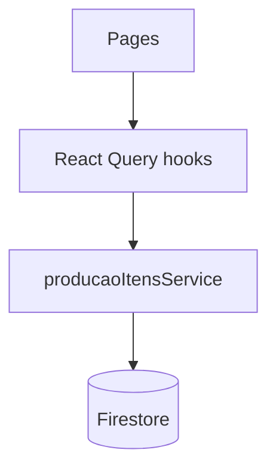

# Arquitetura — Domínio de Produção

Este documento descreve a arquitetura do domínio de Produção **sem alterar** regras do Firestore e **sem alterar** o fluxo de negócio (Entrada/Saída/Finalizar).

## Entry points

- UI:
  - `src/domains/producao/pages/ControleProducao.tsx`
  - `src/domains/producao/pages/ApontamentoOP.tsx`
  - `src/domains/producao/pages/DashboardTV.tsx`
- Hooks:
  - `src/domains/producao/producao.hooks.ts`
- Service:
  - `src/domains/producao/services/producao-itens.service.ts`

## Fluxo (UI → Hooks → Service → Firestore)

## Conceitos

- **Item de Produção**: unidade de trabalho que transita por `setorAtual` e `status`.
- **Movimentação**: registro imutável de transições (setor/status), contendo `empresaId`, timestamps e usuário.

## Invariantes (fonte: `CONTEXT.md`)

- Toda leitura/escrita/consulta precisa estar escopada por `empresaId`.
- Produção já está operacional: mudanças devem ser internas/segurança/integridade **sem alterar fluxo**.

